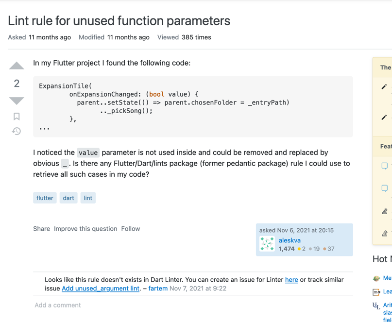

## InnoQ

# Code style guide

The InnoQ organization formalizes the unified guide to writing code in Dart/Flutter based off of the
official [Effective Dart guidelines](https://dart.dev/guides/language/effective-dart/style)
as follows:

### Naming convention

Our style guide includes three most widely used flavors of naming Identifiers:

- UpperCamelCase (classes, enums, typedefs, type parameters, annotations)

```dart
class HttpRequest {
  /*...*/
}

typedef Predicate<T> = bool Function(T value);
```

- lowercase_with_underscores (libraries, packages, directories, source files, 'as' imports)

```dart
import 'package:angular_components/angular_components.dart' as angular_components;
```

- lowerCamelCase (other identifiers, vars, consts, finals, functions, etc.)

```dart

const pi = 3.14;
const defaultTimeout = 1000;
final urlScheme = RegExp('^([a-z]+):');

class Dice {
  static final numberGenerator = Random();
}
```

> Important: Effective Dart says you can use SCREAMING_CAPS to comply with legacy code.
> As we do not work with legacy, our code style does not allow SCREAMING_CAPS at all.
> If you find yourself needing to use it, this means that you need refactor the code,
> so that you do not work with such legacy code.

- Abbreviations: write no-caps.

```dart
class HttpConnection {}

class DBIOPort {}

class TVVcr {}

class MrRogers {}

var httpRequest = 1;
var uiHandler = 2;
var userId = 3;
Id id;
```

### Use 2-spaced Tabs

### Prefer _, __, etc., for unused parameters in callback functions

Good:
```bash
futureOfVoid.then((_) {
  print('Operation complete.');
});
```

Bad:
```bash
_functionWithoutReturnType(Map<String, int> abacaba) {
  print(1);
  print(2);
  // 123
}
```

This seems to not be implemented by default, so we implemented it ourselves:


For the bad code up above this is what the analyzer finds with the new lint rule:


And the problem is resolved as we rename abacaba to _

It also works with __, ___, and other number of underscores!

### Write out the return type

If you're not returning a `dynamic`, but `void`
then you need to always specify the return type explicitly for the function.

Good:

```dart
void _doSomething() {
  print("Doing something...");
}
```

Bad:

```dart
_doSomething() {
  print("Doing something...");
}
```

We have made a custom linting rule for this specific style guide point:


See the last chapter of this markdown to fire custom lints

### Avoid returning `null` for `void` functions

Write `return;` instead of `return null;` for functions returning `void`.

### Do not use one letter prefixes

Bad: `kDefaultTimeout`

### Order of imports:

directives_ordering

Good:

```dart
import 'dart:async';
import 'dart:html';

import 'package:bar/bar.dart';
import 'package:foo/foo.dart';

import 'util.dart';

export 'src/error.dart';
```

### Lines no more than 80 chars long:

lines_longer_than_80_chars

### Enforce curly braces for statement blocks always:

curly_braces_in_flow_control_structures

Good:

```bash
if (isWeekDay) {
  print('Bike to work!');
} else {
  print('Go dancing or read a book!');
}

if (arg == null) return defaultValue;
```

Bad:

```bash
if (overflowChars != other.overflowChars)
  return overflowChars < other.overflowChars;
```

### Utilize `dart format`

https://github.com/dart-lang/dart_style/wiki/Formatting-Rules

### Custom linting

`dart run custom_lint` to run custom linting rules that our team wrote
if `dart analyze` does not work